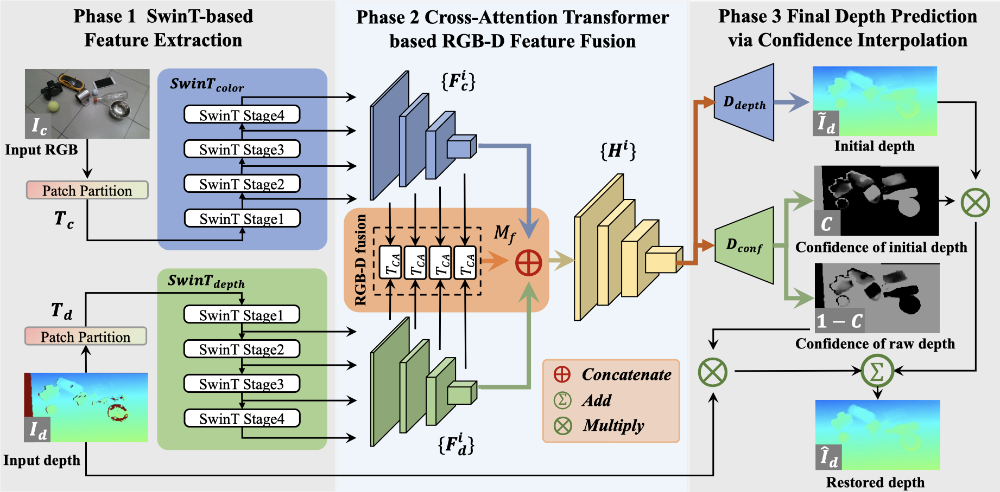

# SwinDRNet-Pipeline

This work is a SwinDRNet pipeline for Intel Realsense D435i, and may work for other depth cameras.

## System Dependencies (May not required for just using)
```bash
sudo apt-get install libhdf5-10 libhdf5-serial-dev libhdf5-dev libhdf5-cpp-11
sudo apt install libopenexr-dev zlib1g-dev openexr
```
## Setup
- ### Install pip dependencies

**This may break your environment! Make sure you have a backup.**

They have tested on Ubuntu 20.04 with an NVIDIA GeForce RTX 2080 and NVIDIA GeForce RTX 3090 with Python 3.7, I have tested on Ubuntu 20.04 with an NVIDIA GeForce GTX 1650Ti with Python 3.8, and The code may work on other systems. Install the dependencies using pip.
You can try this if you are adding the pipeline to an existing project (environment):
```bash
pip install -r requirments_no_version.txt
```
or you can use this with version limitation, but the version may be outdated:
```bash
pip install -r requirments_version.txt
```
- ### Download models

Download their model. Alternatively, you can download files [*manually*](https://mirrors.pku.edu.cn/dl-release/DREDS_ECCV2022/).

```bash
cd models
bash DOWNLOAD.sh
cd ..
```
- ### Testing
The result is in the log folder. You need to pay attention to the details of transparent items, not the whole image. Masks is recommended for real application.
Below is an example for testing the trained SwinDRNet model:
```bash
python test.py
```
## License and Credit

This work is based on [*official SwinDRNet*](https://pku-epic.github.io/DREDS/) and [*SwinDRNet by rnlee*](https://github.com/rnlee1998/SwinDRNet).
The test data is from [*ClearPose*](https://github.com/opipari/ClearPose).

 This work and are licensed under [*CC BY-NC 4.0*][cc-by-nc].

 [![CC BY-NC 4.0][cc-by-nc-image]][cc-by-nc]

 [cc-by-nc]: https://creativecommons.org/licenses/by-nc/4.0/
 [cc-by-nc-image]: https://licensebuttons.net/l/by-nc/4.0/88x31.png

##### Official description from SwinDRNet:
>### SwinDRNet:
>This is the official implementation of SwinDRNet, a depth restoration network proposed in _["Domain Randomization-Enhanced Depth Simulation and Restoration for Perceiving and Grasping Specular and Transparent Objects"](https://arxiv.org/abs/2208.03792)_. SwinDRNet takes inputs of a colored RGB image along with its aligned depth image and outputs a refined depth that restores the error area of the depth image and completes the invalid area caused by specular and transparent objects. The refined depth can be directly used for some downstream tasks (e.g., category-level object 6D pose estimation and robotic grasping). For more details, please see our paper and video.
>
>
##### More: 
>[*Readme of SwinDRNet official repository*](./README_father.md)
